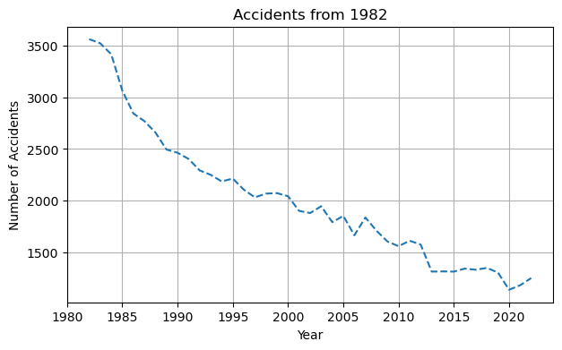
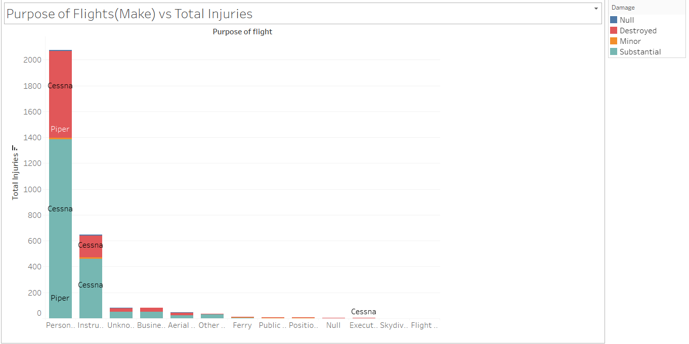
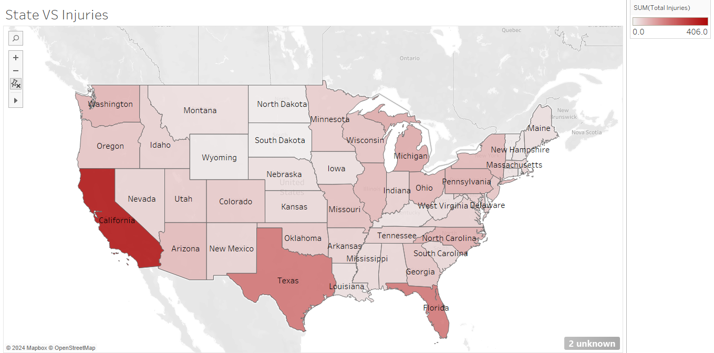

# Flight-Damage-Stats
  ### Introduction
As part of our company's strategic expansion into new industries, we are venturing into the aviation sector, aiming to acquire and operate aircraft for both commercial and private purposes. However, understanding the risks associated with different aircraft types is crucial for making informed purchasing decisions.

The Flight-Damage-Stats project addresses this challenge by analyzing historical data on airplane damage to identify which aircraft types represent the lowest risk. By leveraging data visualization and statistical analysis, this project aims to provide actionable insights that will guide our new aviation division in selecting the safest and most reliable aircraft for our business.

### Business Problem
To investigate the risks involved in the Aviation Industry and come up with an informed decision. We have to investigate the risks associated with the Industry  based on historical damage data, which will make us with our business goal.

### Project Objective
1. Analyze the Given data
2. Create a storyline by visualization from the Data provided.
3. Come up with an analysis to come up with data-based decision for our aviation division

### <u> Data Understanding </u>

## *Data Source* 
  ([Data Source](https://www.kaggle.com/datasets/khsamaha/aviation-accident-database-synopses))

## Description of Data 
I have thoroughly processed the dataset mentioned above, which involved an extensive data cleaning phase to ensure accuracy and consistency. Following this meticulous cleaning process, I performed various visualizations to extract and present meaningful insights from the data. These visualizations help to better understand the underlying patterns and trends, facilitating informed decision-making.

[Data cleaning % Visualization Process](joseph.ipynb)

## Data Visualization 
 A presentation of All Accidents and the years 

 

A presentation of Purpose of flight vs Make 
 

A presentation of Purpose of State vs Total Injuries 

###  <u> Conclusion </u>

 